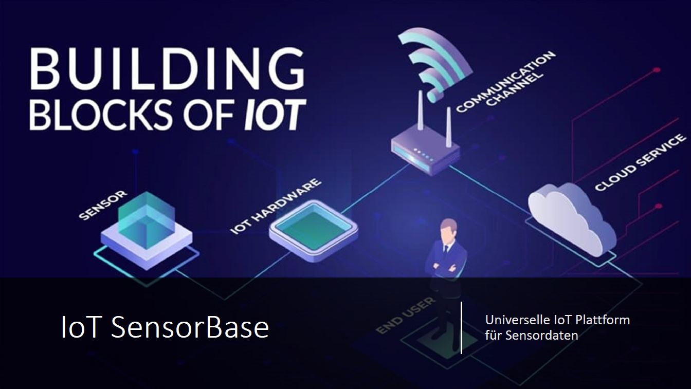

[![Contributors][contributors-shield]][contributors-url]
[![Forks][forks-shield]][forks-url]
[![Stargazers][stars-shield]][stars-url]
[![Issues][issues-shield]][issues-url]
[![MIT License][license-shield]][license-url]
[![LinkedIn][linkedin-shield]][linkedin-url]

<!-- PROJECT LOGO -->
 

  

  <h3 align="center">IOT Sensor Base</h3>

  

    A project at FH-Wels.
     
    <a href="https://github.com/AlphaRalph/IoTSensorBase"><strong>Explore the docs »</strong></a>
     
  

<!-- TABLE OF CONTENTS -->

  
Table of Contents

  <ol>
    <li><a href="#about-the-project">About The Project</a></li>
	<li><a href="#discussion">Discussion</a></li>
    <li><a href="#getting-started">Getting Started</a></li>    
	<li><a href="#Implementation">Implementation Overview</a></li>
    <li><a href="#roadmap">Roadmap</a></li>    
  </ol>

<!-- ABOUT THE PROJECT -->
## About The Project

![IoT SensorBase][product-screenshot]

The aim is to develop a sensor platform, which is independent of the measured variables, records data and sends it to a cloud service.
In cloud services this data is analysed and visualised.

Project scope:
* Familiarisation with current IoT technologies
* Creation of a universal software architecture
* Realisation of a showcase, e.g."environmental measurement"

Fields of activity:
* Software development/programming with .NET, Python
* Database and SQL
* Cloud services
* Sensors
* Communication (WIFI,LTE etc)

(<a href="#top">back to top</a>)

<!-- discussion -->
## Discussion

From a set of keywords to a concept idea.
What did we <a href="docs/DISCUSSION.md">discuss</a> about before the project started.

At the end we agreed the following architecture:
![IoT SensorBase][Architecture]

(<a href="#top">back to top</a>)

<!-- Getting Started -->
## Getting Started

<a href="docs/OVERVIEW.md">Getting Started Guide</a> includes a description of how to get the solution run.

(<a href="#top">back to top</a>)

<!-- Implementation -->
## Implementation

Here you can find an overview about the <a href="docs/IMPLEMENTATION_OV.md">implementation</a>.

(<a href="#top">back to top</a>)

<!-- Roadmap -->
## Roadmap

In our project we identified four main topics:

* **reading data from various sensors and write data to database**
- [x] implement template for micro service 
	- [x] write data to MongoDB at localhost
	- [x] acquire temperature and humidity from sensor
	- [x] acquire CO2 level from sensor
- [x] autostart micro services at startup
- [ ] ...

* **establish a connection to cloud and send data in correct format**
- [x] implement a device gateway to connect to source DB and MQTT-Broker
- [ ] handle KEY Files for authentification and authorisation
	- [x] creation of KEY Files is done manually
	- [ ] fully authomated handling of new devices
- [x] retriev data from the source DB cyclically
- [x] forward data to configured outbound channel
- [x] IoT topic can be configured (could be a serial number)
- [x] outbound channel sends all data one by one 
	- [ ] outbound channel can be configured to send all data in a bulk
	- [ ] outbound channel can be configured to compress data
- [x] multiple channes are configurable
- [x] inbound data is sent to all outbound channels
- [x] after exception connections are restored

* **store received data in cloud database**
- [x] how to handle message from MQTT broker
- [x] which database should be used
- [x] how to store in Database

* **visualize data**
- [x] what tool can be used for visualisation
- [x] what database can be used as source for visualisation
- [x] how to realise dashboards

(<a href="#top">back to top</a>)

<!-- MARKDOWN LINKS & IMAGES -->
<!-- https://www.markdownguide.org/basic-syntax/#reference-style-links -->
[contributors-shield]: https://img.shields.io/github/contributors/alphaRalph/IoTSensorBase.svg?style=for-the-badge
[contributors-url]: https://github.com/alphaRalph/IoTSensorBase/graphs/contributors
[forks-shield]: https://img.shields.io/github/forks/alphaRalph/IoTSensorBase.svg?style=for-the-badge
[forks-url]: https://github.com/alphaRalph/IoTSensorBase/network/members
[stars-shield]: https://img.shields.io/github/stars/alphaRalph/IoTSensorBase.svg?style=for-the-badge
[stars-url]: https://github.com/alphaRalph/IoTSensorBase/stargazers
[issues-shield]: https://img.shields.io/github/issues/alphaRalph/IoTSensorBase.svg?style=for-the-badge
[issues-url]: https://github.com/alphaRalph/IoTSensorBase/issues
[license-shield]: https://img.shields.io/github/license/alphaRalph/IoTSensorBase.svg?style=for-the-badge
[license-url]: https://github.com/alphaRalph/IoTSensorBase/blob/master/LICENSE.txt
[linkedin-shield]: https://img.shields.io/badge/-LinkedIn-black.svg?style=for-the-badge&logo=linkedin&colorB=555
[linkedin-url]: https://linkedin.com/in/alphaRalph
[product-screenshot]: images/screenshot_1.png
[Architecture]: images/IoT-SensorBase.png
